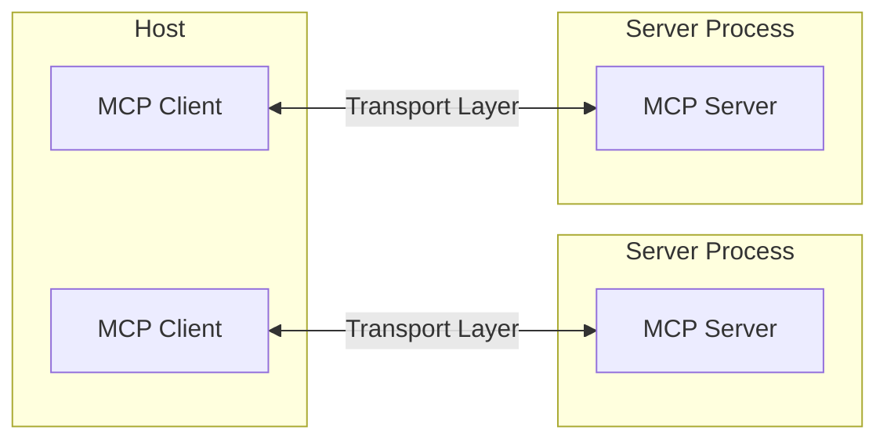
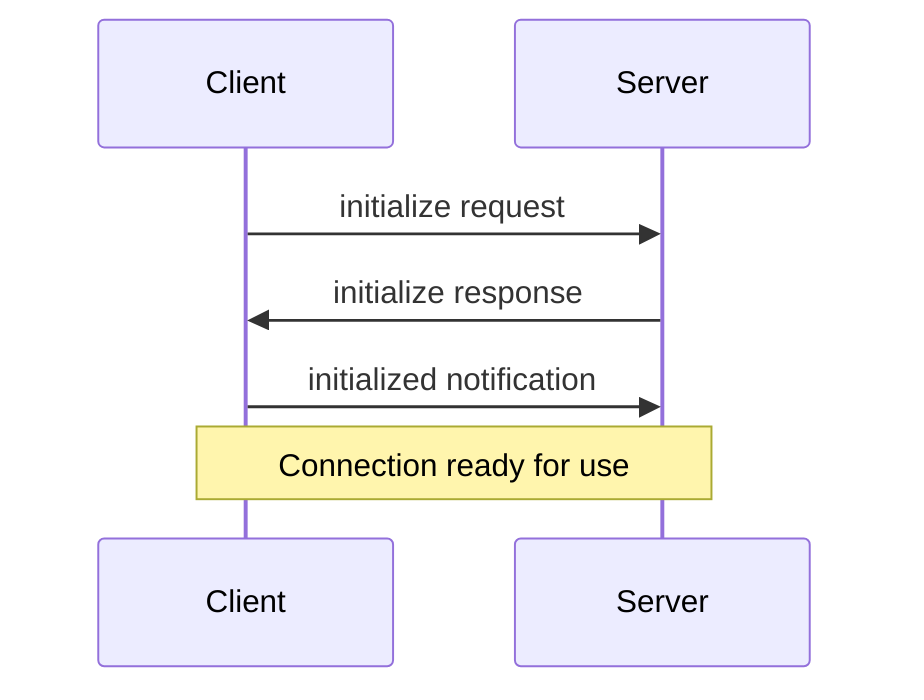

# Core architecture

> Understand how MCP connects clients, servers, and LLMs


The Model Context Protocol (MCP) is built on a flexible, extensible architecture that enables seamless communication between LLM applications and integrations. This document covers the core architectural components and concepts.


## Overview


MCP follows a client-server architecture where:


* **Hosts** are LLM applications (like Claude Desktop or IDEs) that initiate connections

* **Clients** maintain 1:1 connections with servers, inside the host application

* **Servers** provide context, tools, and prompts to clients





## Core components


### Protocol layer


The protocol layer handles message framing, request/response linking, and high-level communication patterns.


<Tabs>

<Tab title="TypeScript">

```typescript

class Protocol<Request, Notification, Result> {

// Handle incoming requests

setRequestHandler<T>(schema: T, handler: (request: T, extra: RequestHandlerExtra) => Promise<Result>): void


// Handle incoming notifications

setNotificationHandler<T>(schema: T, handler: (notification: T) => Promise<void>): void


// Send requests and await responses

request<T>(request: Request, schema: T, options?: RequestOptions): Promise<T>


// Send one-way notifications

notification(notification: Notification): Promise<void>

}

```

</Tab>


<Tab title="Python">

```python

class Session(BaseSession[RequestT, NotificationT, ResultT]):

async def send_request(

self,

request: RequestT,

result_type: type[Result]

) -> Result:

"""Send request and wait for response. Raises McpError if response contains error."""

# Request handling implementation


async def send_notification(

self,

notification: NotificationT

) -> None:

"""Send one-way notification that doesn't expect response."""

# Notification handling implementation


async def _received_request(

self,

responder: RequestResponder[ReceiveRequestT, ResultT]

) -> None:

"""Handle incoming request from other side."""

# Request handling implementation


async def _received_notification(

self,

notification: ReceiveNotificationT

) -> None:

"""Handle incoming notification from other side."""

# Notification handling implementation

```

</Tab>

</Tabs>


Key classes include:


* `Protocol`

* `Client`

* `Server`


### Transport layer


The transport layer handles the actual communication between clients and servers. MCP supports multiple transport mechanisms:


1. **Stdio transport**

* Uses standard input/output for communication

* Ideal for local processes


2. **HTTP with SSE transport**

* Uses Server-Sent Events for server-to-client messages

* HTTP POST for client-to-server messages


All transports use [JSON-RPC](https://www.jsonrpc.org/) 2.0 to exchange messages. See the [specification](/specification/) for detailed information about the Model Context Protocol message format.


### Message types


MCP has these main types of messages:


1. **Requests** expect a response from the other side:

```typescript

interface Request {

method: string;

params?: { ... };

}

```


2. **Results** are successful responses to requests:

```typescript

interface Result {

[key: string]: unknown;

}

```


3. **Errors** indicate that a request failed:

```typescript

interface Error {

code: number;

message: string;

data?: unknown;

}

```


4. **Notifications** are one-way messages that don't expect a response:

```typescript

interface Notification {

method: string;

params?: { ... };

}

```


## Connection lifecycle


### 1. Initialization





1. Client sends `initialize` request with protocol version and capabilities

2. Server responds with its protocol version and capabilities

3. Client sends `initialized` notification as acknowledgment

4. Normal message exchange begins


### 2. Message exchange


After initialization, the following patterns are supported:


* **Request-Response**: Client or server sends requests, the other responds

* **Notifications**: Either party sends one-way messages


### 3. Termination


Either party can terminate the connection:


* Clean shutdown via `close()`

* Transport disconnection

* Error conditions


## Error handling


MCP defines these standard error codes:


```typescript

enum ErrorCode {

// Standard JSON-RPC error codes

ParseError = -32700,

InvalidRequest = -32600,

MethodNotFound = -32601,

InvalidParams = -32602,

InternalError = -32603

}

```


SDKs and applications can define their own error codes above -32000.


Errors are propagated through:


* Error responses to requests

* Error events on transports

* Protocol-level error handlers


## Implementation example


Here's a basic example of implementing an MCP server:


<Tabs>

<Tab title="TypeScript">

```typescript

import { Server } from "@modelcontextprotocol/sdk/server/index.js";

import { StdioServerTransport } from "@modelcontextprotocol/sdk/server/stdio.js";


const server = new Server({

name: "example-server",

version: "1.0.0"

}, {

capabilities: {

resources: {}

}

});


// Handle requests

server.setRequestHandler(ListResourcesRequestSchema, async () => {

return {

resources: [

{

uri: "example://resource",

name: "Example Resource"

}

]

};

});


// Connect transport

const transport = new StdioServerTransport();

await server.connect(transport);

```

</Tab>


<Tab title="Python">

```python

import asyncio

import mcp.types as types

from mcp.server import Server

from mcp.server.stdio import stdio_server


app = Server("example-server")


@app.list_resources()

async def list_resources() -> list[types.Resource]:

return [

types.Resource(

uri="example://resource",

name="Example Resource"

)

]


async def main():

async with stdio_server() as streams:

await app.run(

streams[0],

streams[1],

app.create_initialization_options()

)


if __name__ == "__main__":

asyncio.run(main())

```

</Tab>

</Tabs>


## Best practices


### Transport selection


1. **Local communication**

* Use stdio transport for local processes

* Efficient for same-machine communication

* Simple process management


2. **Remote communication**

* Use SSE for scenarios requiring HTTP compatibility

* Consider security implications including authentication and authorization


### Message handling


1. **Request processing**

* Validate inputs thoroughly

* Use type-safe schemas

* Handle errors gracefully

* Implement timeouts


2. **Progress reporting**

* Use progress tokens for long operations

* Report progress incrementally

* Include total progress when known


3. **Error management**

* Use appropriate error codes

* Include helpful error messages

* Clean up resources on errors


## Security considerations


1. **Transport security**

* Use TLS for remote connections

* Validate connection origins

* Implement authentication when needed


2. **Message validation**

* Validate all incoming messages

* Sanitize inputs

* Check message size limits

* Verify JSON-RPC format


3. **Resource protection**

* Implement access controls

* Validate resource paths

* Monitor resource usage

* Rate limit requests


4. **Error handling**

* Don't leak sensitive information

* Log security-relevant errors

* Implement proper cleanup

* Handle DoS scenarios


## Debugging and monitoring


1. **Logging**

* Log protocol events

* Track message flow

* Monitor performance

* Record errors


2. **Diagnostics**

* Implement health checks

* Monitor connection state

* Track resource usage

* Profile performance


3. **Testing**

* Test different transports

* Verify error handling

* Check edge cases

* Load test servers

---

# Example Servers


> A list of example servers and implementations


This page showcases various Model Context Protocol (MCP) servers that demonstrate the protocol's capabilities and versatility. These servers enable Large Language Models (LLMs) to securely access tools and data sources.


## Reference implementations


These official reference servers demonstrate core MCP features and SDK usage:


### Data and file systems


* **[Filesystem](https://github.com/modelcontextprotocol/servers/tree/main/src/filesystem)** - Secure file operations with configurable access controls

* **[PostgreSQL](https://github.com/modelcontextprotocol/servers/tree/main/src/postgres)** - Read-only database access with schema inspection capabilities

* **[SQLite](https://github.com/modelcontextprotocol/servers/tree/main/src/sqlite)** - Database interaction and business intelligence features

* **[Google Drive](https://github.com/modelcontextprotocol/servers/tree/main/src/gdrive)** - File access and search capabilities for Google Drive


### Development tools


* **[Git](https://github.com/modelcontextprotocol/servers/tree/main/src/git)** - Tools to read, search, and manipulate Git repositories

* **[GitHub](https://github.com/modelcontextprotocol/servers/tree/main/src/github)** - Repository management, file operations, and GitHub API integration

* **[GitLab](https://github.com/modelcontextprotocol/servers/tree/main/src/gitlab)** - GitLab API integration enabling project management

* **[Sentry](https://github.com/modelcontextprotocol/servers/tree/main/src/sentry)** - Retrieving and analyzing issues from Sentry.io


### Web and browser automation


* **[Brave Search](https://github.com/modelcontextprotocol/servers/tree/main/src/brave-search)** - Web and local search using Brave's Search API

* **[Fetch](https://github.com/modelcontextprotocol/servers/tree/main/src/fetch)** - Web content fetching and conversion optimized for LLM usage

* **[Puppeteer](https://github.com/modelcontextprotocol/servers/tree/main/src/puppeteer)** - Browser automation and web scraping capabilities


### Productivity and communication


* **[Slack](https://github.com/modelcontextprotocol/servers/tree/main/src/slack)** - Channel management and messaging capabilities

* **[Google Maps](https://github.com/modelcontextprotocol/servers/tree/main/src/google-maps)** - Location services, directions, and place details

* **[Memory](https://github.com/modelcontextprotocol/servers/tree/main/src/memory)** - Knowledge graph-based persistent memory system


### AI and specialized tools


* **[EverArt](https://github.com/modelcontextprotocol/servers/tree/main/src/everart)** - AI image generation using various models

* **[Sequential Thinking](https://github.com/modelcontextprotocol/servers/tree/main/src/sequentialthinking)** - Dynamic problem-solving through thought sequences

* **[AWS KB Retrieval](https://github.com/modelcontextprotocol/servers/tree/main/src/aws-kb-retrieval-server)** - Retrieval from AWS Knowledge Base using Bedrock Agent Runtime


## Official integrations


These MCP servers are maintained by companies for their platforms:


* **[Axiom](https://github.com/axiomhq/mcp-server-axiom)** - Query and analyze logs, traces, and event data using natural language

* **[Browserbase](https://github.com/browserbase/mcp-server-browserbase)** - Automate browser interactions in the cloud

* **[Cloudflare](https://github.com/cloudflare/mcp-server-cloudflare)** - Deploy and manage resources on the Cloudflare developer platform

* **[E2B](https://github.com/e2b-dev/mcp-server)** - Execute code in secure cloud sandboxes

* **[Neon](https://github.com/neondatabase/mcp-server-neon)** - Interact with the Neon serverless Postgres platform

* **[Obsidian Markdown Notes](https://github.com/calclavia/mcp-obsidian)** - Read and search through Markdown notes in Obsidian vaults

* **[Qdrant](https://github.com/qdrant/mcp-server-qdrant/)** - Implement semantic memory using the Qdrant vector search engine

* **[Raygun](https://github.com/MindscapeHQ/mcp-server-raygun)** - Access crash reporting and monitoring data

* **[Search1API](https://github.com/fatwang2/search1api-mcp)** - Unified API for search, crawling, and sitemaps

* **[Stripe](https://github.com/stripe/agent-toolkit)** - Interact with the Stripe API

* **[Tinybird](https://github.com/tinybirdco/mcp-tinybird)** - Interface with the Tinybird serverless ClickHouse platform

* **[Weaviate](https://github.com/weaviate/mcp-server-weaviate)** - Enable Agentic RAG through your Weaviate collection(s)


## Community highlights


A growing ecosystem of community-developed servers extends MCP's capabilities:


* **[Docker](https://github.com/ckreiling/mcp-server-docker)** - Manage containers, images, volumes, and networks

* **[Kubernetes](https://github.com/Flux159/mcp-server-kubernetes)** - Manage pods, deployments, and services

* **[Linear](https://github.com/jerhadf/linear-mcp-server)** - Project management and issue tracking

* **[Snowflake](https://github.com/datawiz168/mcp-snowflake-service)** - Interact with Snowflake databases

* **[Spotify](https://github.com/varunneal/spotify-mcp)** - Control Spotify playback and manage playlists

* **[Todoist](https://github.com/abhiz123/todoist-mcp-server)** - Task management integration


> **Note:** Community servers are untested and should be used at your own risk. They are not affiliated with or endorsed by Anthropic.


For a complete list of community servers, visit the [MCP Servers Repository](https://github.com/modelcontextprotocol/servers).


## Getting started


### Using reference servers


TypeScript-based servers can be used directly with `npx`:


```bash

npx -y @modelcontextprotocol/server-memory

```


Python-based servers can be used with `uvx` (recommended) or `pip`:


```bash

# Using uvx

uvx mcp-server-git


# Using pip

pip install mcp-server-git

python -m mcp_server_git

```


### Configuring with Claude


To use an MCP server with Claude, add it to your configuration:


```json

{

  "mcpServers": {

    "memory": {

      "command": "npx",

      "args": ["-y", "@modelcontextprotocol/server-memory"]

    },

    "filesystem": {

      "command": "npx",

      "args": ["-y", "@modelcontextprotocol/server-filesystem", "/path/to/allowed/files"]

    },

    "github": {

      "command": "npx",

      "args": ["-y", "@modelcontextprotocol/server-github"],

      "env": {

        "GITHUB_PERSONAL_ACCESS_TOKEN": "<YOUR_TOKEN>"

      }

    }

  }

}

```


## Additional resources


* [MCP Servers Repository](https://github.com/modelcontextprotocol/servers) - Complete collection of reference implementations and community servers

* [Awesome MCP Servers](https://github.com/punkpeye/awesome-mcp-servers) - Curated list of MCP servers

* [MCP CLI](https://github.com/wong2/mcp-cli) - Command-line inspector for testing MCP servers

* [MCP Get](https://mcp-get.com) - Tool for installing and managing MCP servers

* [Supergateway](https://github.com/supercorp-ai/supergateway) - Run MCP stdio servers over SSE

* [Zapier MCP](https://zapier.com/mcp) - MCP Server with over 7,000+ apps and 30,000+ actions


Visit our [GitHub Discussions](https://github.com/orgs/modelcontextprotocol/discussions) to engage with the MCP community.

---

# Tools


> Enable LLMs to perform actions through your server


Tools are a powerful primitive in the Model Context Protocol (MCP) that enable servers to expose executable functionality to clients. Through tools, LLMs can interact with external systems, perform computations, and take actions in the real world.


<Note>

  Tools are designed to be **model-controlled**, meaning that tools are exposed from servers to clients with the intention of the AI model being able to automatically invoke them (with a human in the loop to grant approval).

</Note>


## Overview


Tools in MCP allow servers to expose executable functions that can be invoked by clients and used by LLMs to perform actions. Key aspects of tools include:


* **Discovery**: Clients can list available tools through the `tools/list` endpoint

* **Invocation**: Tools are called using the `tools/call` endpoint, where servers perform the requested operation and return results

* **Flexibility**: Tools can range from simple calculations to complex API interactions


Like [resources](/docs/concepts/resources), tools are identified by unique names and can include descriptions to guide their usage. However, unlike resources, tools represent dynamic operations that can modify state or interact with external systems.


## Tool definition structure


Each tool is defined with the following structure:


```typescript

{

  name: string;          // Unique identifier for the tool

  description?: string;  // Human-readable description

  inputSchema: {         // JSON Schema for the tool's parameters

    type: "object",

    properties: { ... }  // Tool-specific parameters

  },

  annotations?: {        // Optional hints about tool behavior

    title?: string;      // Human-readable title for the tool

    readOnlyHint?: boolean;    // If true, the tool does not modify its environment

    destructiveHint?: boolean; // If true, the tool may perform destructive updates

    idempotentHint?: boolean;  // If true, repeated calls with same args have no additional effect

    openWorldHint?: boolean;   // If true, tool interacts with external entities

  }

}

```


## Implementing tools


Here's an example of implementing a basic tool in an MCP server:


<Tabs>

  <Tab title="TypeScript">

    ```typescript

    const server = new Server({

      name: "example-server",

      version: "1.0.0"

    }, {

      capabilities: {

        tools: {}

      }

    });


    // Define available tools

    server.setRequestHandler(ListToolsRequestSchema, async () => {

      return {

        tools: [{

          name: "calculate_sum",

          description: "Add two numbers together",

          inputSchema: {

            type: "object",

            properties: {

              a: { type: "number" },

              b: { type: "number" }

            },

            required: ["a", "b"]

          }

        }]

      };

    });


    // Handle tool execution

    server.setRequestHandler(CallToolRequestSchema, async (request) => {

      if (request.params.name === "calculate_sum") {

        const { a, b } = request.params.arguments;

        return {

          content: [

            {

              type: "text",

              text: String(a + b)

            }

          ]

        };

      }

      throw new Error("Tool not found");

    });

    ```

  </Tab>


  <Tab title="Python">

    ```python

    app = Server("example-server")


    @app.list_tools()

    async def list_tools() -> list[types.Tool]:

        return [

            types.Tool(

                name="calculate_sum",

                description="Add two numbers together",

                inputSchema={

                    "type": "object",

                    "properties": {

                        "a": {"type": "number"},

                        "b": {"type": "number"}

                    },

                    "required": ["a", "b"]

                }

            )

        ]


    @app.call_tool()

    async def call_tool(

        name: str,

        arguments: dict

    ) -> list[types.TextContent | types.ImageContent | types.EmbeddedResource]:

        if name == "calculate_sum":

            a = arguments["a"]

            b = arguments["b"]

            result = a + b

            return [types.TextContent(type="text", text=str(result))]

        raise ValueError(f"Tool not found: {name}")

    ```

  </Tab>

</Tabs>


## Example tool patterns


Here are some examples of types of tools that a server could provide:


### System operations


Tools that interact with the local system:


```typescript

{

  name: "execute_command",

  description: "Run a shell command",

  inputSchema: {

    type: "object",

    properties: {

      command: { type: "string" },

      args: { type: "array", items: { type: "string" } }

    }

  }

}

```


### API integrations


Tools that wrap external APIs:


```typescript

{

  name: "github_create_issue",

  description: "Create a GitHub issue",

  inputSchema: {

    type: "object",

    properties: {

      title: { type: "string" },

      body: { type: "string" },

      labels: { type: "array", items: { type: "string" } }

    }

  }

}

```


### Data processing


Tools that transform or analyze data:


```typescript

{

  name: "analyze_csv",

  description: "Analyze a CSV file",

  inputSchema: {

    type: "object",

    properties: {

      filepath: { type: "string" },

      operations: {

        type: "array",

        items: {

          enum: ["sum", "average", "count"]

        }

      }

    }

  }

}

```


## Best practices


When implementing tools:


1. Provide clear, descriptive names and descriptions

2. Use detailed JSON Schema definitions for parameters

3. Include examples in tool descriptions to demonstrate how the model should use them

4. Implement proper error handling and validation

5. Use progress reporting for long operations

6. Keep tool operations focused and atomic

7. Document expected return value structures

8. Implement proper timeouts

9. Consider rate limiting for resource-intensive operations

10. Log tool usage for debugging and monitoring


## Security considerations


When exposing tools:


### Input validation


* Validate all parameters against the schema

* Sanitize file paths and system commands

* Validate URLs and external identifiers

* Check parameter sizes and ranges

* Prevent command injection


### Access control


* Implement authentication where needed

* Use appropriate authorization checks

* Audit tool usage

* Rate limit requests

* Monitor for abuse


### Error handling


* Don't expose internal errors to clients

* Log security-relevant errors

* Handle timeouts appropriately

* Clean up resources after errors

* Validate return values


## Tool discovery and updates


MCP supports dynamic tool discovery:


1. Clients can list available tools at any time

2. Servers can notify clients when tools change using `notifications/tools/list_changed`

3. Tools can be added or removed during runtime

4. Tool definitions can be updated (though this should be done carefully)


## Error handling


Tool errors should be reported within the result object, not as MCP protocol-level errors. This allows the LLM to see and potentially handle the error. When a tool encounters an error:


1. Set `isError` to `true` in the result

2. Include error details in the `content` array


Here's an example of proper error handling for tools:


<Tabs>

  <Tab title="TypeScript">

    ```typescript

    try {

      // Tool operation

      const result = performOperation();

      return {

        content: [

          {

            type: "text",

            text: `Operation successful: ${result}`

          }

        ]

      };

    } catch (error) {

      return {

        isError: true,

        content: [

          {

            type: "text",

            text: `Error: ${error.message}`

          }

        ]

      };

    }

    ```

  </Tab>


  <Tab title="Python">

    ```python

    try:

        # Tool operation

        result = perform_operation()

        return types.CallToolResult(

            content=[

                types.TextContent(

                    type="text",

                    text=f"Operation successful: {result}"

                )

            ]

        )

    except Exception as error:

        return types.CallToolResult(

            isError=True,

            content=[

                types.TextContent(

                    type="text",

                    text=f"Error: {str(error)}"

                )

            ]

        )

    ```

  </Tab>

</Tabs>


This approach allows the LLM to see that an error occurred and potentially take corrective action or request human intervention.


## Tool annotations


Tool annotations provide additional metadata about a tool's behavior, helping clients understand how to present and manage tools. These annotations are hints that describe the nature and impact of a tool, but should not be relied upon for security decisions.


### Purpose of tool annotations


Tool annotations serve several key purposes:


1. Provide UX-specific information without affecting model context

2. Help clients categorize and present tools appropriately

3. Convey information about a tool's potential side effects

4. Assist in developing intuitive interfaces for tool approval


### Available tool annotations


The MCP specification defines the following annotations for tools:


| Annotation        | Type    | Default | Description                                                                                                                          |

| ----------------- | ------- | ------- | ------------------------------------------------------------------------------------------------------------------------------------ |

| `title`           | string  | -       | A human-readable title for the tool, useful for UI display                                                                           |

| `readOnlyHint`    | boolean | false   | If true, indicates the tool does not modify its environment                                                                          |

| `destructiveHint` | boolean | true    | If true, the tool may perform destructive updates (only meaningful when `readOnlyHint` is false)                                     |

| `idempotentHint`  | boolean | false   | If true, calling the tool repeatedly with the same arguments has no additional effect (only meaningful when `readOnlyHint` is false) |

| `openWorldHint`   | boolean | true    | If true, the tool may interact with an "open world" of external entities                                                             |


### Example usage


Here's how to define tools with annotations for different scenarios:


```typescript

// A read-only search tool

{

  name: "web_search",

  description: "Search the web for information",

  inputSchema: {

    type: "object",

    properties: {

      query: { type: "string" }

    },

    required: ["query"]

  },

  annotations: {

    title: "Web Search",

    readOnlyHint: true,

    openWorldHint: true

  }

}


// A destructive file deletion tool

{

  name: "delete_file",

  description: "Delete a file from the filesystem",

  inputSchema: {

    type: "object",

    properties: {

      path: { type: "string" }

    },

    required: ["path"]

  },

  annotations: {

    title: "Delete File",

    readOnlyHint: false,

    destructiveHint: true,

    idempotentHint: true,

    openWorldHint: false

  }

}


// A non-destructive database record creation tool

{

  name: "create_record",

  description: "Create a new record in the database",

  inputSchema: {

    type: "object",

    properties: {

      table: { type: "string" },

      data: { type: "object" }

    },

    required: ["table", "data"]

  },

  annotations: {

    title: "Create Database Record",

    readOnlyHint: false,

    destructiveHint: false,

    idempotentHint: false,

    openWorldHint: false

  }

}

```


### Integrating annotations in server implementation


<Tabs>

  <Tab title="TypeScript">

    ```typescript

    server.setRequestHandler(ListToolsRequestSchema, async () => {

      return {

        tools: [{

          name: "calculate_sum",

          description: "Add two numbers together",

          inputSchema: {

            type: "object",

            properties: {

              a: { type: "number" },

              b: { type: "number" }

            },

            required: ["a", "b"]

          },

          annotations: {

            title: "Calculate Sum",

            readOnlyHint: true,

            openWorldHint: false

          }

        }]

      };

    });

    ```

  </Tab>


  <Tab title="Python">

    ```python

    from mcp.server.fastmcp import FastMCP


    mcp = FastMCP("example-server")


    @mcp.tool(

        annotations={

            "title": "Calculate Sum",

            "readOnlyHint": True,

            "openWorldHint": False

        }

    )

    async def calculate_sum(a: float, b: float) -> str:

        """Add two numbers together.

        

        Args:

            a: First number to add

            b: Second number to add

        """

        result = a + b

        return str(result)

    ```

  </Tab>

</Tabs>


### Best practices for tool annotations


1. **Be accurate about side effects**: Clearly indicate whether a tool modifies its environment and whether those modifications are destructive.


2. **Use descriptive titles**: Provide human-friendly titles that clearly describe the tool's purpose.


3. **Indicate idempotency properly**: Mark tools as idempotent only if repeated calls with the same arguments truly have no additional effect.


4. **Set appropriate open/closed world hints**: Indicate whether a tool interacts with a closed system (like a database) or an open system (like the web).


5. **Remember annotations are hints**: All properties in ToolAnnotations are hints and not guaranteed to provide a faithful description of tool behavior. Clients should never make security-critical decisions based solely on annotations.


## Testing tools


A comprehensive testing strategy for MCP tools should cover:


* **Functional testing**: Verify tools execute correctly with valid inputs and handle invalid inputs appropriately

* **Integration testing**: Test tool interaction with external systems using both real and mocked dependencies

* **Security testing**: Validate authentication, authorization, input sanitization, and rate limiting

* **Performance testing**: Check behavior under load, timeout handling, and resource cleanup

* **Error handling**: Ensure tools properly report errors through the MCP protocol and clean up resources
