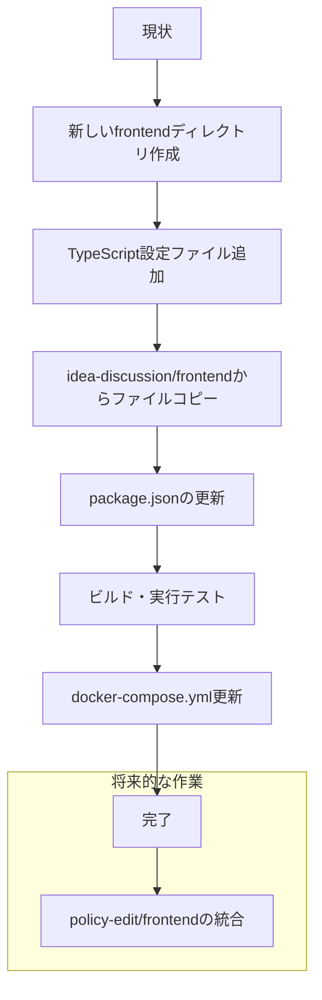

# idea-discussion/frontendからルートレベルfrontendへの移行計画

## 概要

現在のプロジェクト構造では、2つの独立したフロントエンドアプリケーションがあります：

1. **idea-discussion/frontend (①)**
   - React + Vite (JavaScript/JSX)
   - React Router DOM
   - Tailwind CSS
   - 管理パネル、チャット機能などのコンポーネントを含む

2. **policy-edit/frontend (②)**
   - React + Vite (TypeScript/TSX)
   - React Router DOM
   - Tailwind CSS
   - Zustand (状態管理)
   - Markdown関連ライブラリ
   - GitHub連携機能

この計画では、idea-discussion/frontend (①) をルートレベルの新しいfrontendディレクトリ (③) に移行し、将来的にpolicy-edit/frontend (②) を統合できるようにする手順を説明します。

## 移行の目標

1. idea-discussion/frontend (①) をルートレベルの新しいfrontendディレクトリ (③) にコピー
2. TypeScriptサポートを追加して将来的な統合を容易にする
3. 既存の機能を維持しながら、新しいディレクトリでビルド・実行できるようにする
4. 将来的にpolicy-edit/frontend (②) を統合しやすい構造にする

## 移行プロセス



## 詳細な工程

### 工程1: 新しいfrontendディレクトリの作成

```bash
# ルートディレクトリに新しいfrontendディレクトリを作成
mkdir -p frontend/src frontend/public
```

### 工程2: TypeScript設定ファイルの追加

TypeScriptとJavaScriptの両方をサポートする設定ファイルを作成します。

**frontend/tsconfig.json**:
```json
{
  "compilerOptions": {
    "target": "ES2020",
    "useDefineForClassFields": true,
    "lib": ["ES2020", "DOM", "DOM.Iterable"],
    "module": "ESNext",
    "skipLibCheck": true,

    /* Bundler mode */
    "moduleResolution": "bundler",
    "allowImportingTsExtensions": true,
    "resolveJsonModule": true,
    "isolatedModules": true,
    "noEmit": true,
    "jsx": "react-jsx",

    /* Linting */
    "strict": true,
    "noUnusedLocals": true,
    "noUnusedParameters": true,
    "noFallthroughCasesInSwitch": true,

    /* Allow JS files */
    "allowJs": true,
    "checkJs": false
  },
  "include": ["src"],
  "references": [{ "path": "./tsconfig.node.json" }]
}
```

**frontend/tsconfig.node.json**:
```json
{
  "compilerOptions": {
    "composite": true,
    "skipLibCheck": true,
    "module": "ESNext",
    "moduleResolution": "bundler",
    "allowSyntheticDefaultImports": true
  },
  "include": ["vite.config.ts"]
}
```

**frontend/vite.config.ts**:
```typescript
import { defineConfig } from 'vite'
import react from '@vitejs/plugin-react'

// https://vitejs.dev/config/
export default defineConfig({
  plugins: [react()],
  server: {
    port: 5175, // 既存のサービスと競合しないポート
    host: '0.0.0.0'
  }
})
```

**frontend/src/vite-env.d.ts**:
```typescript
/// <reference types="vite/client" />
```

### 工程3: idea-discussion/frontendからのファイルコピー

```bash
# src内のファイルをコピー
cp -r idea-discussion/frontend/src/* frontend/src/

# publicディレクトリ内のファイルをコピー
cp -r idea-discussion/frontend/public/* frontend/public/

# index.htmlをコピー
cp idea-discussion/frontend/index.html frontend/

# .gitignoreをコピー
cp idea-discussion/frontend/.gitignore frontend/
```

### 工程4: package.jsonの更新

**frontend/package.json**:
```json
{
  "name": "idobata-frontend",
  "private": true,
  "version": "0.1.0",
  "type": "module",
  "scripts": {
    "dev": "vite",
    "build": "tsc -b && vite build",
    "lint": "eslint .",
    "preview": "vite preview"
  },
  "dependencies": {
    "@tailwindcss/vite": "^4.1.3",
    "react": "^19.0.0",
    "react-dom": "^19.0.0",
    "react-router-dom": "^7.5.0"
  },
  "devDependencies": {
    "@eslint/js": "^9.21.0",
    "@types/react": "^19.0.10",
    "@types/react-dom": "^19.0.4",
    "@vitejs/plugin-react": "^4.3.4",
    "autoprefixer": "^10.4.21",
    "eslint": "^9.21.0",
    "eslint-plugin-react-hooks": "^5.1.0",
    "eslint-plugin-react-refresh": "^0.4.19",
    "globals": "^15.15.0",
    "postcss": "^8.5.3",
    "tailwindcss": "^4.1.3",
    "typescript": "~5.7.2",
    "typescript-eslint": "^8.24.1",
    "vite": "^6.2.0"
  }
}
```

### 工程5: ESLint設定の更新

**frontend/eslint.config.js**:
```javascript
import js from '@eslint/js';
import { FlatCompat } from '@eslint/eslintrc';
import globals from 'globals';

const compat = new FlatCompat();

export default [
  js.configs.recommended,
  ...compat.extends('plugin:react-hooks/recommended'),
  ...compat.extends('plugin:react-refresh/recommended'),
  {
    languageOptions: {
      globals: {
        ...globals.browser,
        ...globals.node
      },
      parserOptions: {
        ecmaVersion: 'latest',
        sourceType: 'module',
        ecmaFeatures: {
          jsx: true
        }
      }
    },
    rules: {
      'no-unused-vars': 'warn',
      'react-refresh/only-export-components': [
        'warn',
        { allowConstantExport: true }
      ]
    }
  }
];
```

### 工程6: docker-compose.ymlの更新

docker-compose.ymlに新しいfrontendサービスを追加します：

```yaml
# 既存のサービスの後に追加
frontend:
  container_name: frontend-dev
  image: node:20-alpine
  working_dir: /app
  volumes:
    - ./frontend:/app
    # Add node_modules volume
    - /app/node_modules
  ports:
    - "5175:5175" # 新しいポート
  command: sh -c "npm install && npm run dev -- --host 0.0.0.0"
  env_file:
    - .env
  environment:
    - NODE_ENV=development
    - VITE_API_BASE_URL=${IDEA_FRONTEND_API_BASE_URL} # 初期段階ではidea-discussionのAPIを使用
```

### 工程7: .envファイルの更新

.envファイルに新しいfrontendサービスのための環境変数を追加します：

```
# 既存の環境変数に加えて
FRONTEND_API_BASE_URL=http://localhost:3000
```

### 工程8: ビルドと実行テスト

```bash
# 新しいfrontendディレクトリに移動
cd frontend

# 依存関係のインストール
npm install

# 開発サーバーの起動
npm run dev

# ビルドテスト
npm run build
```

### 工程9: Dockerでのテスト

```bash
# docker-compose.ymlを更新した後
docker-compose up -d frontend
```

## 将来的な統合計画

```mermaid
flowchart LR
    A[現状: 新しいfrontend (③)] --> B[policy-edit機能の統合]
    B --> C[TypeScript完全移行]
    C --> D[統合されたフロントエンド]
```

1. policy-edit/frontendの機能を段階的に統合
   - 共通コンポーネントの特定と再利用
   - 状態管理の統一（Zustandの採用）
   - APIエンドポイントの調整
2. JSXファイルを徐々にTSXに移行
3. 完全に統合されたフロントエンドの実現

## 注意点

1. 移行中は既存のサービス（idea-discussion/frontend, policy-edit/frontend）を維持し、並行して動作させることができます。
2. 新しいfrontendディレクトリでの開発が安定したら、徐々に機能を移行していきます。
3. TypeScriptとJavaScriptの混在は問題なく、Viteは両方のファイル形式をサポートします。
4. 将来的な統合のために、コンポーネント設計とディレクトリ構造を整理することを推奨します。

## 作業ログ

### 2025/4/26
- 作業1完了: frontendディレクトリを作成し、その下にsrcとpublicディレクトリを作成しました。
- 作業2完了: TypeScript設定ファイルを追加しました。以下のファイルを作成:
  - frontend/tsconfig.json
  - frontend/tsconfig.node.json
  - frontend/vite.config.ts
  - frontend/src/vite-env.d.ts
- 作業3完了: idea-discussion/frontendからファイルをコピーしました。以下のファイルとディレクトリをコピー:
  - src内のすべてのファイル（App.jsx, main.jsx, コンポーネントなど）
  - public内のファイル（vite.svg）
  - index.html
  - .gitignore
- 作業4完了: package.jsonを作成しました。以下の設定を含む:
  - プロジェクト名: idobata-frontend
  - TypeScriptビルドを含むビルドスクリプト
  - React、React Router DOMなどの依存関係
  - TypeScript関連の開発依存関係
- 作業5完了: ESLint設定ファイルを作成しました。以下の設定を含む:
  - ESLintの推奨設定
  - React Hooksの推奨ルール
  - React Refreshの推奨ルール
  - JSX対応のパーサーオプション
  - カスタムルール（未使用変数の警告など）

## 作業時の注意
- ユーザーからの指示への返答はかならず日本語で行ってください。
- 基本的にコマンドの標準出力は取得できないので、commandResult.txt ファイルにパイプで出力してその結果をファイルから読み取ってください。
- コマンドの結果が不明です、という状態で次の作業に進まないでください。
- 必要になるまでファイルは実装しないでください。空の ts ファイルなどは作らないでください。
- コメントや Doc は記載しないでコードのみを記載してください。
- その時点では必要のない網羅性のためのメソッドは実装せず、その作業時点で明らかに必要なメソッドのみを実装する方針としてください。
- 仕様が変わりやすいプロトタイピングなので、unittest は最小限にしたいです。指示されるまでテストは記載しないでください。
